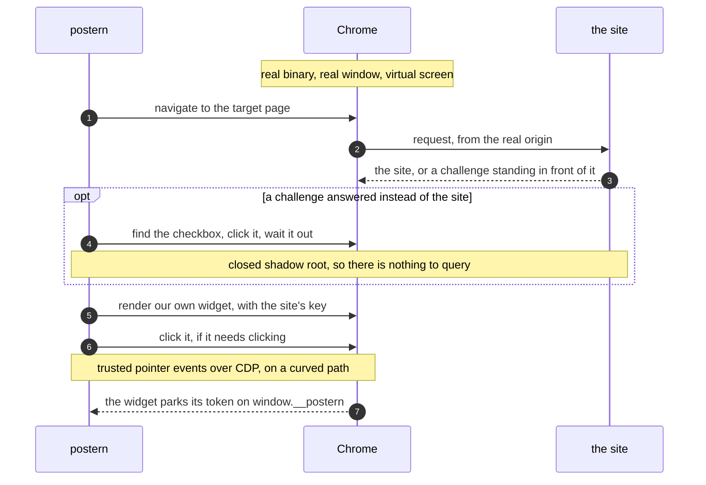

<p align="center">
  <picture>
    <source media="(prefers-color-scheme: dark)" srcset="docs/logo-dark.svg">
    
  </picture>
</p>

<h1 align="center">postern</h1>

<p align="center">
  <strong>A captcha solver that drives a real Chrome instead of pretending to be one.</strong>
</p>

<p align="center">
  <a href="https://github.com/mikketa/postern/actions/workflows/ci.yml"></a>
  
  
  
</p>

<p align="center">
  <a href="#what-works">What works</a> ·
  <a href="#install">Install</a> ·
  <a href="#use-it">Use it</a> ·
  <a href="#picture-challenges">Picture challenges</a> ·
  <a href="#running-it-at-volume">At volume</a> ·
  <a href="#how-it-works">How it works</a> ·
  <a href="#flags">Flags</a>
</p>

```console
$ postern solve -url https://example.com/login -sitekey 0x4AAAAAAA...
0.qF8mZ2...9dK1
```

No token farm. No paid captcha API. No headless browser dressed up to look human.
Postern launches the Chrome already on the machine, gives it a screen nobody is looking
at, renders the widget itself, and hands back the token.

> [!NOTE]
> A postern is the small side door of a fortress — the one you walk through instead of
> attacking the wall.

<br>

## What works

Every row was run against the live service. Nothing here is an estimate.

| Challenge | Result | Time |
| :--- | :--- | :--- |
| **Turnstile** — production sitekey, managed mode | **5 / 5** tokens | ~3s |
| Same, through `serve` — 10 requests at concurrency 3 | **10 / 10** tokens | median 4s, 13.7s total |
| **reCAPTCHA v2 checkbox** — image challenge served | **6 / 6** tokens | median 11.5s |
| **reCAPTCHA v2 checkbox** — no challenge served | token | ~5s |
| **reCAPTCHA v2 invisible** | token | ~4s |
| **reCAPTCHA v3** | token | ~4s |
| **Cloudflare managed challenge** in front of a site | **6 / 8** crossed | 13.3s, then the page's own widget |

<sup>Measured between 2026-08-11 and 2026-08-15. Five runs is five runs, not a rate — read the
denominators.</sup>

> [!IMPORTANT]
> **Your address will move these numbers more than any change to postern.** The Cloudflare
> row was measured through a datacenter exit; through a commercial VPN exit the same code,
> at the same minute, was refused every single time. The reCAPTCHA rows come from an
> ordinary residential connection with a profile that had been used before. Treat the table
> as evidence that the mechanics work, not as a rate you will reproduce.

### What it does not do

| | |
| --- | --- |
| **hCaptcha** | Not implemented. It is not one challenge but a family — a 3×3 grid, click-the-object, and drag-and-drop — and it escalates by risk score, so the tier a test sitekey serves is not the tier a real site serves |
| **FunCaptcha / Arkose** | Not implemented. Rotating 3D tasks that change on their own schedule |
| **GeeTest** | Not implemented. The slider needs a drag, which `internal/input` cannot do yet |
| **Text and audio captchas** | Out of scope. reCAPTCHA's audio challenge is refused by Google outright as an automated request |

The missing primitive behind two of those is a drag: `internal/input` can click and move,
never press-move-release. It is a small piece of work on top of the curved path that is
already there, and it is the next thing worth building.

<br>

## Install

```sh
go install github.com/mikketa/postern/cmd/postern@latest
```

You also need **Chrome or Chromium**, and **Xvfb** unless you pass `-display host` or
`-headless` (`xorg-server-xvfb` on Arch, `xvfb` on Debian).

<br>

## Use it

### One shot

The token goes to stdout and nothing else does, so it pipes straight into whatever needs it.

```sh
postern solve -url https://example.com/login -sitekey 0x4AAAAAAA...
postern solve -kind recaptcha-v3 -url https://example.com -sitekey 6Lc... -action login
```

`-kind` takes `turnstile` (the default), `recaptcha-v2`, `recaptcha-v2-invisible` or
`recaptcha-v3`.

### As a local service

```sh
postern serve -addr 127.0.0.1:8099
```

```sh
curl -s localhost:8099/solve -d '{
  "url": "https://example.com/login",
  "sitekey": "0x4AAAAAAA..."
}'
```

```json
{ "token": "0.qF8mZ2...9dK1", "elapsed_ms": 3140 }
```

| Field | Type | Required | Notes |
| :--- | :--- | :---: | :--- |
| `url` | string | yes | The page the widget belongs to — it decides the origin |
| `sitekey` | string | yes | Found in the target page markup |
| `kind` | string | no | As above. Defaults to `turnstile` |
| `action` | string | no | Turnstile and reCAPTCHA v3; must match what the site uses |
| `cdata` | string | no | Turnstile only |
| `timeout_ms` | int | no | Overrides the server default for this request |

Errors come back as `{"error": "..."}` with a `4xx`/`5xx` status. A fleet with nothing
rested returns **`503` with `Retry-After`**. `GET /health` returns `{"status": "ok"}`, and
`GET /fleet` reports what each identity has done.

> [!WARNING]
> `serve` binds to localhost and has **no authentication**. Keep it on localhost, or put
> something in front of it.

<br>

## Picture challenges

Sooner or later reCAPTCHA puts up a grid of photographs. Postern drives that grid — finds
it, measures it, answers it in as many rounds as it takes, submits it — but the *looking*
is delegated to a command you nominate. Which model to use is not a decision a captcha
solver should make for you.

```sh
postern solve -kind recaptcha-v2 -url ... -sitekey ... \
    -image-solver "python3 examples/solver-template.py"
```

The protocol is deliberately dumb. A solver is a twenty-line script:

| | |
| :--- | :--- |
| **argv** | path to a PNG of the panel, prompt included |
| **stdout** | one `x,y` per line, in pixels within that image; nothing means nothing to click |
| **exit 0** | answered |
| **exit 2** | cannot answer this one — postern asks for a different challenge |
| **other** | a failure, which ends the solve |

Postern also passes `POSTERN_PROMPT`, `POSTERN_COLUMNS` and `POSTERN_TILES` through the
environment, read out of the challenge document itself rather than guessed from the
screenshot. A solver may ignore all three.

Three examples ship with it: `solver-template.py` to build on, `solver-yolos.py` (a plain
detector), and `solver-vision.py`.

### How good is `solver-vision.py`

| | Grids answered exactly |
| :--- | :--- |
| On the 48-grid bench it was tuned against | **48 / 48** |
| The same solver under cross-validation | **45 / 48** |
| Installed without `-export` (two models not exported locally) | **38 / 48** |

**45 of 48 is the honest number.** A bench a solver was fitted on cannot also grade it, so
every knob was refit with the grid it fixes held out — one that scored an extra grid did
not survive that and was thrown away. The 6/6 row in the table at the top used the
`-export` install.

One process per grid is the right protocol for a twenty-line script and the wrong one for
600MB of models, so `solver-vision.py` keeps a copy of itself resident and answers over a
socket. **2.49s a grid becomes 1.30s.** Postern is not involved: it still runs a command
that takes a PNG and prints coordinates.

> [!TIP]
> `examples/install-vision.sh -export` sets up `solver-vision.py` and its models in one
> command. Without `-export` you get a working install at 38 of 48 — the two models that
> close the gap have to be exported on your machine.

**[Read the long version →](docs/picture-challenges.md)** — why a detector alone is not
enough, why CLIP alone is worse, how the trained head was fitted, and every idea that was
measured and thrown away.

<br>

## Running it at volume

One browser answering every request is one identity, and an identity wears out. So `serve`
can work from a fleet. An identity is a profile and a way out, kept together for life.

```sh
cat > identities.txt <<'EOF'
# name    proxy — as your provider sells it, or as a url
alice     gate.example.com:8000:user-session-1:hunter2
bob       gate.example.com:8000:user-session-2:hunter2
carol     socks5://127.0.0.1:9050
EOF

postern serve -identities identities.txt -warm-pages sites.txt
```

Adding an identity is adding a line. Its profile is created next to the others, and it
takes itself browsing once before its first solve. Three rules do the work:

| | |
| :--- | :--- |
| **Rest** | every identity waits a few minutes after a solve, spread so the fleet does not solve on one beat |
| **Quarantine** | three failures in a row sets an identity aside for the best part of an hour |
| **Memory** | how each identity has done is written to disk, so a restart does not hand a worn one a clean slate |

> [!TIP]
> Throughput is not how fast one solve is. It is roughly **identities ÷ rest** — ten
> identities resting four minutes each is about two solves a minute, indefinitely. Ask for
> more than the fleet can rest through and you get **503 with `Retry-After`**, which is the
> fleet working rather than failing.

`GET /fleet` shows what each identity has done. The useful number is the ratio per
identity: several failing together is an address going bad, one failing alone is that
profile burnt.

> [!IMPORTANT]
> Several identities behind one proxy are one identity wearing several profiles, and
> several with no proxy at all share this machine's address. Postern says so at startup,
> because both configurations quietly defeat the whole exercise.

<br>

## How it works



Five decisions carry the whole thing.

**The browser is genuine.** The real binary, launched without the automation banner,
reusing the same profile every run so it ages like a person's — and closed properly on the
way out, without which the profile never actually aged.

**It is windowed, not headless.** This one came from a measurement. Against a production
Turnstile sitekey, headless Chrome was refused **6 times out of 6**, even with its user
agent corrected, its GPU re-enabled and its screen size fixed. The same code driving a
windowed Chrome on a virtual display was accepted **7 times out of 7**. So postern stops
being headless instead of patching symptoms one at a time. It starts its own Xvfb, which
shows nothing on screen either.

**The widget is ours.** Postern renders a fresh widget with the site's key rather than
hunting for the one on the page. Sites lay out their forms a hundred ways; the widget APIs
are identical everywhere.

**A site can answer with a challenge instead of itself.** Cloudflare's managed challenge
holds every request behind an interstitial, so there is no page to put a widget on until
that is crossed. Postern crosses it before it does anything else. The checkbox there lives
in a closed shadow root — no iframe, nothing readable — so it is found by the one thing it
cannot hide: it fills the space of a widget while holding no text at all.

**The pointer is real.** The checkbox lives in a cross-origin iframe nothing on the page
can reach into, so postern clicks it from the outside — pointer events over CDP, so the
page sees `isTrusted`, on a curved path with easing and jitter rather than teleporting onto
the target.

<br>

## Flags

**Browser** — every command takes these.

| Flag | Default | Meaning |
| :--- | :--- | :--- |
| `-profile` | `~/.config/postern/profile` | Chrome profile directory, reused across runs |
| `-display` | `virtual` | `virtual` starts an Xvfb of our own; `host` uses your session and is visible |
| `-headless` | `false` | Headless mode. Measurably more detectable — see above |
| `-screen` | `1920x1080` | Virtual screen size, `WxH`. The window is sized from it |
| `-chrome` | autodetect | Path to the Chrome binary |
| `-proxy` | none | Go out through this proxy; `user:pass@` is answered over CDP, not passed to Chrome |

**`postern solve`** — one token, to stdout.

| Flag | Default | Meaning |
| :--- | :--- | :--- |
| `-url` | *required* | The page the widget belongs to |
| `-sitekey` | *required* | As found in the target page markup |
| `-kind` | `turnstile` | `turnstile`, `recaptcha-v2`, `recaptcha-v2-invisible`, `recaptcha-v3` |
| `-action` | none | Turnstile and reCAPTCHA v3, if the site sets one |
| `-cdata` | none | Turnstile `cData`, if the site sets one |
| `-image-solver` | none | Command that answers picture grids |
| `-save-panels` | none | Directory to keep every grid in, to calibrate a solver against later |
| `-timeout` | `60s` | Give up after this long — the whole solve, crossing included |

**`postern serve`** — the same, over HTTP.

| Flag | Default | Meaning |
| :--- | :--- | :--- |
| `-addr` | `127.0.0.1:8099` | Listen address |
| `-concurrency` | `2` | Solves running at the same time |
| `-identities` | none | Fleet file, one identity per line — see [above](#running-it-at-volume) |
| `-warm-pages` | none | Pages a new identity browses before its first solve |
| `-image-solver` | none | As above |
| `-timeout` | `60s` | Default per-solve timeout; `timeout_ms` overrides it per request |

**`postern warm`** — take a profile browsing, away from a token.

| Flag | Default | Meaning |
| :--- | :--- | :--- |
| `-pages` | *required* | File of ordinary pages to visit, one per line |
| `-timeout` | `10m` | How long to spend browsing |

> [!TIP]
> **Raise `-timeout` for a site behind a managed challenge.** The crossing takes its budget
> out of the same clock as the solve — about 13s when it goes well, and a good deal more
> when a challenge refuses and another has to be asked for. Postern will not start a second
> challenge it has no time to answer, and says which half of the run ran out.

<br>

## Testing

Cloudflare publishes dummy keys that work from any domain, including localhost:

| Key | What it does |
| :--- | :--- |
| `1x00000000000000000000AA` | Always passes |
| `2x00000000000000000000AB` | Always fails |
| `3x00000000000000000000FF` | Forces an interactive challenge — and **never yields a token** |

> [!CAUTION]
> The third one is a trap worth knowing about. With that key Turnstile never renders its
> iframe at all, so there is nothing to click and nothing to solve; postern says so instead
> of timing out in silence. It is not a regression, and it was verified against an older
> commit before this note was written.

> [!NOTE]
> Dummy keys return a fixed `XXXX.DUMMY.TOKEN.XXXX` with no risk analysis behind it. They
> prove the plumbing works and nothing else, which is why the table at the top was measured
> against a production sitekey.

```sh
go test -short ./...    # no browser
go test ./internal/...  # launches Chrome
```

<br>

## On a server

Postern runs fine on a headless Linux box: Chrome, Xvfb, and about 500MB of RAM — that last
figure is an estimate, unlike the table at the top. A dedicated user is a better idea than
root. Two things a server takes back:

- **No GPU means software rendering.** WebGL reports SwiftShader, which no desktop does.
  Faking the strings is not a fix — extensions, shader precision and raw speed keep giving
  it away.
- **Datacenter IPs carry their own reputation.** Expect challenges more often, and harder,
  than from a residential connection. `-proxy` exists for this.

<br>

## Reputation

One solve is a browser problem. The hundredth is a reputation problem: the same code that
gets a token in the evening gets none at midnight from the same address. Postern has three
answers to that, and they are what makes it hold up over a run rather than over a demo.

**A profile that ages.** Kept across runs and closed properly on the way out, so it keeps
what a profile is supposed to keep. `postern warm -pages sites.txt` takes it browsing, on a
schedule rather than in front of every token.

**A way out that isn't yours.** `-proxy` takes one, password included. Chrome drops proxy
credentials given on the command line and raises a sign-in dialog nobody is there to
answer, so postern strips them off the flag — which also keeps them out of a world-readable
`/proc` — and signs in over CDP instead.

**A fleet instead of an identity.** Rest, quarantine and memory, as above.

> [!IMPORTANT]
> Before blaming reputation, check that your own clicks are landing. One evening went from
> 4 tokens in 10 to **10 in 10** on the same address the moment a misaimed click was found:
> the grids had been answered correctly all along, and the answers were being dispatched off
> screen.

**[The whole trail →](docs/reputation.md)** — what the fleet measured, what a stock-Chrome
control proved, and how a wrong conclusion survived a day of careful measurement.

<br>

## Scope

Postern exists for automating things you are allowed to automate: your own sites, your own
staging environments, end-to-end tests a challenge would otherwise block, and research into
how these challenges behave.

> [!CAUTION]
> Don't point it at services whose terms you have not read, and don't use it to hammer
> someone else's infrastructure.

<br>

## Contributing

The evasion layer is the part that needs the most maintenance, and it is plain JavaScript
in `internal/patches/` for exactly that reason. Files are embedded in filename order and
run before any page script, so you can add or fix one without touching a line of Go.

Two rules for patches:

1. **Only fix what a real Chrome under automation actually gets wrong.** Verify it first.
2. **Make the override conditional.** Redefining a property that was already correct leaves
   a descriptor that does not match a stock browser, which is its own tell.

Adding a vendor means an entry in the registry in `internal/solver/provider.go` and a
bootstrap function that renders the widget. The solve loop does not change.

And the house rule: **claims come with measurements**. If you improve the success rate, say
against what, how many runs, and what it was before.

<br>

## License

[MIT](LICENSE)
