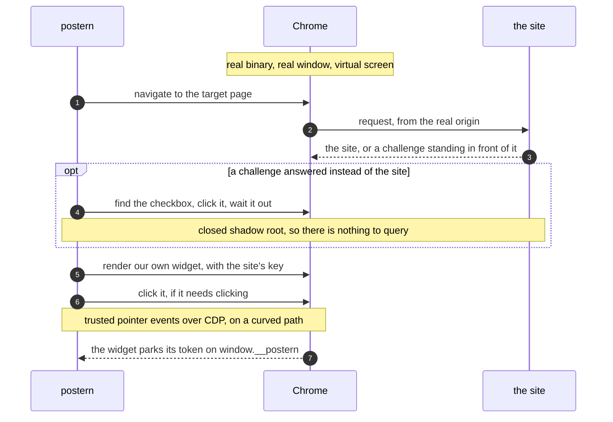

<p align="center">
  <picture>
    <source media="(prefers-color-scheme: dark)" srcset="docs/logo-dark.svg">
    
  </picture>
</p>

<h1 align="center">postern</h1>

<p align="center">
  <strong>A captcha solver that drives a real Chrome instead of pretending to be one.</strong>
</p>

<p align="center">
  <a href="https://github.com/mikketa/postern/actions/workflows/ci.yml"></a>
  
  
  
</p>

<p align="center">
  <a href="#what-works">What works</a> ·
  <a href="#install">Install</a> ·
  <a href="#use-it">Use it</a> ·
  <a href="#drop-in-for-an-existing-client">Drop-in</a> ·
  <a href="#picture-challenges">Picture challenges</a> ·
  <a href="#running-it-at-volume">At volume</a> ·
  <a href="#how-it-works">How it works</a> ·
  <a href="#in-a-container">Container</a> ·
  <a href="#flags">Flags</a>
</p>

```console
$ postern solve -url https://example.com/login -sitekey 0x4AAAAAAA...
0.qF8mZ2...9dK1
```

No token farm. No paid captcha API. No headless browser dressed up to look human.
Postern launches the Chrome already on the machine, gives it a screen nobody is looking
at, renders the widget itself, and hands back the token.

> [!NOTE]
> A postern is the small side door of a fortress — the one you walk through instead of
> attacking the wall.

<br>

## What works

Every row was run against the live service. Nothing here is an estimate.

| Challenge | Result | Time |
| :--- | :--- | :--- |
| **Turnstile** — production sitekey, managed mode | **5 / 5** tokens | ~3s |
| Same, through `serve` — 10 requests at concurrency 3 | **10 / 10** tokens | median 4s, 13.7s total |
| **reCAPTCHA v2 checkbox** — image challenge served | **6 / 6** tokens | median 11.5s |
| **reCAPTCHA v2 checkbox** — no challenge served | token | ~5s |
| **reCAPTCHA v2 invisible** | token | ~4s |
| **reCAPTCHA v3** | token | ~4s |
| **Cloudflare managed challenge** in front of a site | **6 / 8** crossed | 13.3s, then the page's own widget |

<sup>Measured between 2026-08-11 and 2026-08-15. Five runs is five runs, not a rate — read the
denominators.</sup>

> [!IMPORTANT]
> **Your address will move these numbers more than any change to postern.** The Cloudflare
> row was measured through a datacenter exit; through a commercial VPN exit the same code,
> at the same minute, was refused every single time. The reCAPTCHA rows come from an
> ordinary residential connection with a profile that had been used before. Treat the table
> as evidence that the mechanics work, not as a rate you will reproduce.

### What it does not do

| | |
| --- | --- |
| **hCaptcha** | Not implemented. It is not one challenge but a family — a 3×3 grid, click-the-object, and drag-and-drop — and it escalates by risk score, so the tier a test sitekey serves is not the tier a real site serves |
| **FunCaptcha / Arkose** | Not implemented. Rotating 3D tasks that change on their own schedule |
| **GeeTest** | Not implemented. The slider needs a drag, which `internal/input` cannot do yet |
| **Text and audio captchas** | Out of scope. reCAPTCHA's audio challenge is refused by Google outright as an automated request |

The missing primitive behind two of those is a drag: `internal/input` can click and move,
never press-move-release. It is a small piece of work on top of the curved path that is
already there, and it is the next thing worth building.

<br>

## Install

```sh
go install github.com/mikketa/postern/cmd/postern@latest
```

You also need **Chrome or Chromium**, and **Xvfb** unless you pass `-display host` or
`-headless` (`xorg-server-xvfb` on Arch, `xvfb` on Debian).

<br>

## Use it

### One shot

The token goes to stdout and nothing else does, so it pipes straight into whatever needs it.

```sh
postern solve -url https://example.com/login -sitekey 0x4AAAAAAA...
postern solve -kind recaptcha-v3 -url https://example.com -sitekey 6Lc... -action login
```

`-kind` takes `turnstile` (the default), `recaptcha-v2`, `recaptcha-v2-invisible` or
`recaptcha-v3`.

### As a local service

```sh
postern serve -addr 127.0.0.1:8099
```

```sh
curl -s localhost:8099/solve -d '{
  "url": "https://example.com/login",
  "sitekey": "0x4AAAAAAA..."
}'
```

```json
{ "token": "0.qF8mZ2...9dK1", "elapsed_ms": 3140 }
```

| Field | Type | Required | Notes |
| :--- | :--- | :---: | :--- |
| `url` | string | yes | The page the widget belongs to — it decides the origin |
| `sitekey` | string | yes | Found in the target page markup |
| `kind` | string | no | As above. Defaults to `turnstile` |
| `action` | string | no | Turnstile and reCAPTCHA v3; must match what the site uses |
| `cdata` | string | no | Turnstile only |
| `timeout_ms` | int | no | Lowers the server's timeout for this request. It cannot raise it |

`GET /fleet` reports what each identity has done, and `GET /metrics` is below.

`GET /health` answers `200` with the running version and how much of the fleet is free — and
**`503` when the server cannot work at all**, with the reason. The distinction is the point:
a fleet whose identities are all resting is busy and healthy, and restarting it would throw
away every profile's history. A server whose Chrome has died is neither, and wants restarting.
It turns red within one failed request rather than the instant the process dies, because that
is when the connection is discovered closed.

### When it fails

Every error carries a machine-readable `code` beside the message, so branching on the cause
does not mean matching strings:

```json
{ "code": "crossing_refused", "error": "solver: the challenge in front of the page never let us through — ..." }
```

| `code` | Status | What to do about it |
| :--- | :---: | :--- |
| `busy` | 503 | Every identity is resting. Back off — `Retry-After` says how long |
| `timeout` | 502 | The budget ran out. Retry; raise `-timeout` if it is the usual answer |
| `crossing_refused` | 502 | A challenge in front of the site refused us. The lever is the address |
| `challenge_refused` | 502 | The vendor kept serving grids past the point it grades them. Same lever |
| `vendor_error` | 502 | The widget reported a failure of its own — often a wrong sitekey or action |
| `no_image_solver` | 501 | A picture grid arrived and nothing is configured to read it. Retrying will not help |
| `invalid_request` | 400 | Missing fields, bad JSON, or a misspelt one — unknown fields are refused rather than ignored |
| `body_too_large` | 413 | Over 64KB |
| `unauthorized` | 401 | Missing or wrong bearer token |
| `internal` | 500 | Unclassified. A rise here means a class is missing |

The classes come from sentinel errors in the solver, matched with `errors.Is` — so a message
can be reworded for whoever reads it without moving anybody's dashboard.

### Authentication

Set `POSTERN_TOKEN` and every route but the health check requires it:

```sh
POSTERN_TOKEN=$(openssl rand -hex 32) postern serve -addr 127.0.0.1:8099
```

```sh
curl -s localhost:8099/solve -H "Authorization: Bearer $POSTERN_TOKEN" -d '{...}'
```

An environment variable rather than a flag, for the same reason proxy credentials are
stripped off `-proxy`: a command line is readable by every user on the machine through
`/proc`.

A bearer token is a password, and it is sent on every request. So off loopback postern
**will not carry it over cleartext**:

```sh
# Terminate TLS itself
postern serve -addr 0.0.0.0:8099 -tls-cert cert.pem -tls-key key.pem

# Or say that something in front already does
postern serve -addr 0.0.0.0:8099 -behind-tls-proxy
```

The second flag is named for what it claims rather than for what it turns off. An operator
who has a terminator should recognise their own deployment in it; one who does not should
not be tempted by it.

### Drop-in for an existing client

Postern also speaks the 2Captcha legacy interface, so a client already written against one
of the paid services points here by changing its base URL and nothing else.

```sh
# submit
curl -s http://localhost:8099/in.php \
  -d "key=$POSTERN_TOKEN&method=userrecaptcha&googlekey=6Lc...&pageurl=https://example.com"
# OK|120047878299709

# collect, five seconds later
curl -s "http://localhost:8099/res.php?key=$POSTERN_TOKEN&action=get&id=120047878299709"
# OK|03AGdBq26...
```

`json=1` switches both to `{"status":1,"request":"..."}`. The `key` parameter is the same
`POSTERN_TOKEN` as the bearer elsewhere — these two routes authenticate the way the
protocol says to, not with a header no existing client would send.

| Their method | What postern solves |
| :--- | :--- |
| `method=userrecaptcha` | reCAPTCHA v2 |
| `method=userrecaptcha&invisible=1` | reCAPTCHA v2 invisible |
| `method=userrecaptcha&version=v3&action=…` | reCAPTCHA v3 |
| `method=turnstile` | Turnstile |
| anything else | `ERROR_NO_SUCH_METHOD`, immediately rather than after a timeout |

The queue is bounded at ten waiting jobs per concurrent slot, and a submission past that gets
`ERROR_NO_SLOT_AVAILABLE` — the protocol's own word for it, which clients already back off on.
Accepting work there is no prospect of reaching is a worse failure deferred: each waiting job
holds a goroutine and a timer, and every one of them times out having never seen a browser.

Both `googlekey` and `sitekey` are accepted for either vendor, and `pageurl` or `url`,
because clients in the wild send all four. Failures come back as `ERROR_CAPTCHA_UNSOLVABLE`,
`ERROR_NO_SLOT_AVAILABLE` or `ERROR_KEY_DOES_NOT_EXIST` — and with a `200`, because that is
what this protocol does and what its clients are written to read.

> [!NOTE]
> It is a protocol, not a second implementation: both front ends call the same solve path,
> queue in the same slots and land in the same metrics. `/solve` is the better shape — one
> request, one answer, a real status code, a `code` you can branch on — and worth moving to.
> This one is here so nobody has to before they have tried it.

### Operating it

`GET /metrics` reports in Prometheus text format — solve counts by vendor and outcome, a
latency histogram, and the live fleet gauges. It sits behind the same token: how much an
operation solves, and how well, is not public.

```
postern_solves_total{kind="recaptcha-v2",outcome="token",reason="ok"} 41
postern_solves_total{kind="recaptcha-v2",outcome="failed",reason="crossing_refused"} 4
postern_solves_total{kind="recaptcha-v2",outcome="failed",reason="timeout"} 2
postern_solve_duration_seconds_bucket{le="15"} 38
postern_fleet_identities_ready 7
postern_solve_slots_in_use 2
postern_build_info{version="v0.3.1"} 1
```

Failures are counted and timed alongside successes — a solver measured only on the runs
that worked reports a latency nobody experiences. They carry the same `reason` as the
response, which is the difference between *the address is being refused* and *nobody
configured a vision solver*: both are a falling success rate on a graph without it. Both
labels come from closed sets, so the number of series is bounded by the code and not by
traffic. A `busy` rejection is counted but kept out of the latency histogram — it never
solved anything, and including it would drag every quantile toward zero.

Every response carries **`X-Request-Id`**, and every log line about that solve carries the
same value. Send your own and it is kept rather than replaced, so a caller that already
traces requests can join the two sides. A panic returns `500` with a body instead of a
dropped connection, which is otherwise indistinguishable from the network failing.

On `SIGTERM` the listener closes at once and in-flight solves are given **`-timeout` plus
fifteen seconds** to finish, because a solve may legally still be running for all of it. That
includes the ones submitted through `/in.php`, which outlive the request that submitted them
and which `http.Server` therefore knows nothing about.
Size your orchestrator's grace period against that number — Kubernetes defaults to 30
seconds, which is shorter than the default drain. A second signal stops immediately. No client library: the exposition format
is small and stable, and the official one would roughly triple a dependency tree that is
currently two entries, both of them chromedp.

> [!IMPORTANT]
> **Without a token, `serve` refuses to bind to anything but loopback.** Not a warning —
> a warning at startup is read once, on the day it is set up, and never again. `GET /fleet`
> names every identity and whether it is proxied, and `POST /solve` spends the fleet.

<br>

## Picture challenges

Sooner or later reCAPTCHA puts up a grid of photographs. Postern drives that grid — finds
it, measures it, answers it in as many rounds as it takes, submits it — but the *looking*
is delegated to a command you nominate. Which model to use is not a decision a captcha
solver should make for you.

```sh
postern solve -kind recaptcha-v2 -url ... -sitekey ... \
    -image-solver "python3 examples/solver-template.py"
```

The protocol is deliberately dumb. A solver is a twenty-line script:

| | |
| :--- | :--- |
| **argv** | path to a PNG of the panel, prompt included |
| **stdout** | one `x,y` per line, in pixels within that image; nothing means nothing to click |
| **exit 0** | answered |
| **exit 2** | cannot answer this one — postern asks for a different challenge |
| **other** | a failure, which ends the solve |

Postern also passes `POSTERN_PROMPT`, `POSTERN_COLUMNS` and `POSTERN_TILES` through the
environment, read out of the challenge document itself rather than guessed from the
screenshot. A solver may ignore all three.

Three examples ship with it: `solver-template.py` to build on, `solver-yolos.py` (a plain
detector), and `solver-vision.py`.

### How good is `solver-vision.py`

| | Grids answered exactly |
| :--- | :--- |
| On the 48-grid bench it was tuned against | **48 / 48** |
| The same solver under cross-validation | **45 / 48** |
| Installed without `-export` (two models not exported locally) | **38 / 48** |

**45 of 48 is the honest number.** A bench a solver was fitted on cannot also grade it, so
every knob was refit with the grid it fixes held out — one that scored an extra grid did
not survive that and was thrown away. The 6/6 row in the table at the top used the
`-export` install.

One process per grid is the right protocol for a twenty-line script and the wrong one for
600MB of models, so `solver-vision.py` keeps a copy of itself resident and answers over a
socket. **2.49s a grid becomes 1.30s.** Postern is not involved: it still runs a command
that takes a PNG and prints coordinates.

> [!TIP]
> `examples/install-vision.sh -export` sets up `solver-vision.py` and its models in one
> command. Without `-export` you get a working install at 38 of 48 — the two models that
> close the gap have to be exported on your machine.

**[Read the long version →](docs/picture-challenges.md)** — why a detector alone is not
enough, why CLIP alone is worse, how the trained head was fitted, and every idea that was
measured and thrown away.

<br>

## Running it at volume

One browser answering every request is one identity, and an identity wears out. So `serve`
can work from a fleet. An identity is a profile and a way out, kept together for life.

```sh
cat > identities.txt <<'EOF'
# name    proxy — as your provider sells it, or as a url
alice     gate.example.com:8000:user-session-1:hunter2
bob       gate.example.com:8000:user-session-2:hunter2
carol     socks5://127.0.0.1:9050
EOF

postern serve -identities identities.txt -warm-pages sites.txt
```

Adding an identity is adding a line. Its profile is created next to the others, and it
takes itself browsing once before its first solve. Three rules do the work:

| | |
| :--- | :--- |
| **Rest** | every identity waits a few minutes after a solve, spread so the fleet does not solve on one beat |
| **Quarantine** | three failures in a row sets an identity aside for the best part of an hour |
| **Memory** | how each identity has done is written to disk, so a restart does not hand a worn one a clean slate |

> [!TIP]
> Throughput is not how fast one solve is. It is roughly **identities ÷ rest** — ten
> identities resting four minutes each is about two solves a minute, indefinitely. Ask for
> more than the fleet can rest through and you get **503 with `Retry-After`**, which is the
> fleet working rather than failing.

`GET /fleet` shows what each identity has done. The useful number is the ratio per
identity: several failing together is an address going bad, one failing alone is that
profile burnt.

> [!IMPORTANT]
> Several identities behind one proxy are one identity wearing several profiles, and
> several with no proxy at all share this machine's address. Postern says so at startup,
> because both configurations quietly defeat the whole exercise.

<br>

## How it works



Five decisions carry the whole thing.

**The browser is genuine.** The real binary, launched without the automation banner,
reusing the same profile every run so it ages like a person's — and closed properly on the
way out, without which the profile never actually aged.

**It is windowed, not headless.** This one came from a measurement. Against a production
Turnstile sitekey, headless Chrome was refused **6 times out of 6**, even with its user
agent corrected, its GPU re-enabled and its screen size fixed. The same code driving a
windowed Chrome on a virtual display was accepted **7 times out of 7**. So postern stops
being headless instead of patching symptoms one at a time. It starts its own Xvfb, which
shows nothing on screen either.

**The widget is ours.** Postern renders a fresh widget with the site's key rather than
hunting for the one on the page. Sites lay out their forms a hundred ways; the widget APIs
are identical everywhere.

**A site can answer with a challenge instead of itself.** Cloudflare's managed challenge
holds every request behind an interstitial, so there is no page to put a widget on until
that is crossed. Postern crosses it before it does anything else. The checkbox there lives
in a closed shadow root — no iframe, nothing readable — so it is found by the one thing it
cannot hide: it fills the space of a widget while holding no text at all.

**The pointer is real.** The checkbox lives in a cross-origin iframe nothing on the page
can reach into, so postern clicks it from the outside — pointer events over CDP, so the
page sees `isTrusted`, on a curved path with easing and jitter rather than teleporting onto
the target.

<br>

## Flags

**Browser** — every command takes these.

| Flag | Default | Meaning |
| :--- | :--- | :--- |
| `-profile` | `~/.config/postern/profile` | Chrome profile directory, reused across runs |
| `-display` | `virtual` | `virtual` starts an Xvfb of our own; `host` uses your session and is visible |
| `-headless` | `false` | Headless mode. Measurably more detectable — see above |
| `-screen` | `1920x1080` | Virtual screen size, `WxH`. The window is sized from it |
| `-chrome` | autodetect | Path to the Chrome binary |
| `-proxy` | none | Go out through this proxy; `user:pass@` is answered over CDP, not passed to Chrome |

**`postern solve`** — one token, to stdout.

| Flag | Default | Meaning |
| :--- | :--- | :--- |
| `-url` | *required* | The page the widget belongs to |
| `-sitekey` | *required* | As found in the target page markup |
| `-kind` | `turnstile` | `turnstile`, `recaptcha-v2`, `recaptcha-v2-invisible`, `recaptcha-v3` |
| `-action` | none | Turnstile and reCAPTCHA v3, if the site sets one |
| `-cdata` | none | Turnstile `cData`, if the site sets one |
| `-image-solver` | none | Command that answers picture grids |
| `-save-panels` | none | Directory to keep every grid in, to calibrate a solver against later |
| `-timeout` | `60s` | Give up after this long — the whole solve, crossing included |
| `-v` | `false` | Report what the challenge did, on stderr — clicks, rounds, why a run ended |

**`postern serve`** — the same, over HTTP.

| Flag | Default | Meaning |
| :--- | :--- | :--- |
| `-addr` | `127.0.0.1:8099` | Listen address |
| `-concurrency` | `2` | Solves running at the same time |
| `-identities` | none | Fleet file, one identity per line — see [above](#running-it-at-volume) |
| `-warm-pages` | none | Pages a new identity browses before its first solve |
| `-image-solver` | none | As above |
| `-timeout` | `60s` | Per-solve ceiling. `timeout_ms` may ask for less, never more |
| `-tls-cert` | none | Certificate file: serve HTTPS rather than HTTP |
| `-tls-key` | none | Private key file, with `-tls-cert` |
| `-behind-tls-proxy` | `false` | Something in front already terminates TLS, so cleartext off this machine is intended |
| `-log` | `text` | Log format: `text` for a person, `json` for anything that collects them |

`serve` also reads **`POSTERN_TOKEN`** from the environment — see
[Authentication](#authentication). Without it the server will only bind to loopback.

**`postern warm`** — take a profile browsing, away from a token.

| Flag | Default | Meaning |
| :--- | :--- | :--- |
| `-pages` | *required* | File of ordinary pages to visit, one per line |
| `-timeout` | `10m` | How long to spend browsing |

> [!TIP]
> **Raise `-timeout` for a site behind a managed challenge.** The crossing takes its budget
> out of the same clock as the solve — about 13s when it goes well, and a good deal more
> when a challenge refuses and another has to be asked for. Postern will not start a second
> challenge it has no time to answer, and says which half of the run ran out.

<br>

## Testing

Cloudflare publishes dummy keys that work from any domain, including localhost:

| Key | What it does |
| :--- | :--- |
| `1x00000000000000000000AA` | Always passes |
| `2x00000000000000000000AB` | Always fails |
| `3x00000000000000000000FF` | Forces an interactive challenge — and **never yields a token** |

> [!CAUTION]
> The third one is a trap worth knowing about. With that key Turnstile never renders its
> iframe at all, so there is nothing to click and nothing to solve; postern says so instead
> of timing out in silence. It is not a regression, and it was verified against an older
> commit before this note was written.

> [!NOTE]
> Dummy keys return a fixed `XXXX.DUMMY.TOKEN.XXXX` with no risk analysis behind it. They
> prove the plumbing works and nothing else, which is why the table at the top was measured
> against a production sitekey.

```sh
go test -short ./...    # no browser
go test ./internal/...  # launches Chrome
```

<br>

## In a container

```sh
docker build -t postern --build-arg VERSION="$(git describe --tags --always)" .

docker run -d -p 8099:8099 \
  -e POSTERN_TOKEN="$(openssl rand -hex 32)" \
  -v postern-profile:/home/postern/.config/postern \
  --security-opt seccomp=unconfined --shm-size=1g \
  postern -behind-tls-proxy
```

Google Chrome, Xvfb and real fonts, running as a non-root user. Chrome and not Debian's
chromium: chromium reports itself as such in its user agent and ships without the
proprietary codecs, and both are fingerprinting signals on their own.

The volume is the point of mounting anything: the profile is what ages, and an identity
that starts clean on every restart never matures.

The two flags are not optional. `--shm-size` because Chrome puts renderer shared memory
in `/dev/shm`, where Docker's 64M default is not enough for it; `--security-opt
seccomp=unconfined` because Chrome's own sandbox creates a user namespace, which Docker's
default seccomp profile blocks. Passing `--no-sandbox` instead was considered and
rejected: that flag would have to be set where postern launches Chrome, so it would ship
to every user and weaken a browser that has no container around it. Granting the syscall
is the container's job, and it stays in the container.

The image binds `0.0.0.0`, so it will not start without `POSTERN_TOKEN`, and not without
being told how the token is protected — `-behind-tls-proxy` above, or `-tls-cert` and
`-tls-key` with the certificates mounted in. See [Authentication](#authentication). Failing
at startup with the reason is the guard working, not a bug.

> [!CAUTION]
> `-behind-tls-proxy` in the example assumes you actually have one. Publishing that port
> straight to a network without a terminator hands out the token on every request.

> [!WARNING]
> `seccomp=unconfined` turns off syscall filtering for that container, which is more than
> this needs. Chromium's own sandbox has to create a user namespace and most runtimes block
> that syscall by default; the narrow fix is a seccomp profile that allows it, and the
> broad one is above. Passing `--no-sandbox` instead was considered and rejected: the flag
> would have to be set where postern launches Chrome, so it would ship to everyone,
> including the people running no container at all.

<br>

## On a server

Postern runs fine on a headless Linux box: Chrome, Xvfb, and about 500MB of RAM — that last
figure is an estimate, unlike the table at the top. A dedicated user is a better idea than
root. Two things a server takes back:

- **No GPU means software rendering.** WebGL reports SwiftShader, which no desktop does.
  Faking the strings is not a fix — extensions, shader precision and raw speed keep giving
  it away.
- **Datacenter IPs carry their own reputation.** Expect challenges more often, and harder,
  than from a residential connection. `-proxy` exists for this.
- **A hard kill leaves Chrome behind.** Measured: `SIGKILL` on postern left two browser
  processes running. A normal shutdown does not — that path closes the browser politely,
  which is also what writes the profile. Worth a `pkill` in whatever supervises it, or run
  the container, where the PID namespace takes them with it. The tidy fix is `PR_SET_PDEATHSIG`
  on the browser process, which chromedp does not expose.

<br>

## Reputation

One solve is a browser problem. The hundredth is a reputation problem: the same code that
gets a token in the evening gets none at midnight from the same address. Postern has three
answers to that, and they are what makes it hold up over a run rather than over a demo.

**A profile that ages.** Kept across runs and closed properly on the way out, so it keeps
what a profile is supposed to keep. `postern warm -pages sites.txt` takes it browsing, on a
schedule rather than in front of every token.

**A way out that isn't yours.** `-proxy` takes one, password included. Chrome drops proxy
credentials given on the command line and raises a sign-in dialog nobody is there to
answer, so postern strips them off the flag — which also keeps them out of a world-readable
`/proc` — and signs in over CDP instead.

**A fleet instead of an identity.** Rest, quarantine and memory, as above.

> [!IMPORTANT]
> Before blaming reputation, check that your own clicks are landing. One evening went from
> 4 tokens in 10 to **10 in 10** on the same address the moment a misaimed click was found:
> the grids had been answered correctly all along, and the answers were being dispatched off
> screen.

**[The whole trail →](docs/reputation.md)** — what the fleet measured, what a stock-Chrome
control proved, and how a wrong conclusion survived a day of careful measurement.

<br>

## Scope

Postern exists for automating things you are allowed to automate: your own sites, your own
staging environments, end-to-end tests a challenge would otherwise block, and research into
how these challenges behave.

> [!CAUTION]
> Don't point it at services whose terms you have not read, and don't use it to hammer
> someone else's infrastructure.

<br>

## Contributing

The evasion layer is the part that needs the most maintenance, and it is plain JavaScript
in `internal/patches/` for exactly that reason. Files are embedded in filename order and
run before any page script, so you can add or fix one without touching a line of Go.

Two rules for patches:

1. **Only fix what a real Chrome under automation actually gets wrong.** Verify it first.
2. **Make the override conditional.** Redefining a property that was already correct leaves
   a descriptor that does not match a stock browser, which is its own tell.

Adding a vendor means an entry in the registry in `internal/solver/provider.go` and a
bootstrap function that renders the widget. The solve loop does not change.

And the house rule: **claims come with measurements**. If you improve the success rate, say
against what, how many runs, and what it was before.

<br>

## License

[MIT](LICENSE)
